# Attention vs. Recurrence: Benchmarking Transformers and LSTMs for Music Spectral Forecasting

**Dami Thomas, Liam Sheldon, Suraj Reddy**  
*Final project for 6.7960, MIT*

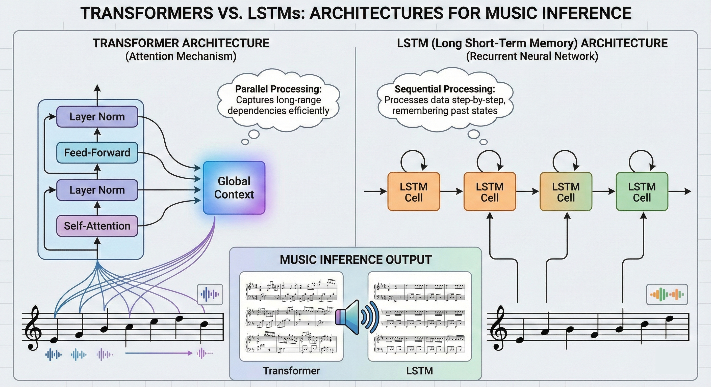  
*Figure 1: Introduction of methods in research project.*

---

## Introduction

With the advent of multi-model models arriving at scale, a unique application: generative music has taken the world by storm. Whether it be music startups seeking to create indistinguishable recreations of popular artists' voices, or simply Professor Shefield experimenting with catchy songs for his 18.600 lectures, the demand for audibly coherent generation is higher than ever. In the past, the modeling of time-series data, an inherent format of music, has required capturing both immediate textural details and long-term structural dependencies. Recurrent Neural Networks (RNNs), and specifically Long Short-Term Memory (LSTM) networks, initially found great success in this arena due to their ability to retain information over time [1].

However, due to the rise of Self-Attention mechanisms, Transformers have gained ground in sequence modeling tasks, raising the research question of their efficacy in audio prediction [2]. This constitutes a contentious topic in deep learning research, as opposed to Natural Language Processing (NLP); audio data’s complexity lies within its texture, as we are not only evaluating mathematically consistent predictions but audibly coherent predictions as well.

---

## Related Works

Even with the advent of Transformer architectures and their NLP success, their dominance of time-series forecasting data is still up for debate. Historically, LSTMs have been the standard for computer-driven music composition, with foundational work by Eck and Schmidhuber going back to 2002, where they trained LSTMs to learn blues improvisation music [3]. However, recent benchmarking studies in other applications yield differing results. For example, Hittawe et al. concluded that LSTMs can outperform Transformers in financial stock data forecasting, showcasing that even with the advent of Transformers, they still struggle with continuous numerical data [4]. On the other hand, Weissenborn et al. concluded that Transformers are significantly stronger with complex and long-range trends in autoregressive video modeling than LSTMs [5].

Recent work in the audio domain regarding Transformers has showcased specialized architectures. Lu et al. introduced SpecTNT, a custom Transformer architecture for music classification, as they brought forth the failures of standard Transformers in capturing spectral dependencies due to the standard vectorized representation of frequency [8]. Their work proposed a complex “Transformer in a Transformer” solution that could model the texture of complex audio data.

Additionally, a major gap in the current literature is the "format" of the music being predicted. Much of the successful work involving Transformers in music, such as the Music Transformer, relies on symbolic data (MIDI events) rather than raw audio [6].

---

## Goals

We aim to build on the foundation of SpecTNT’s findings by introducing two key research-focused shifts. Firstly, we are focusing on the domain of generative forecasting (next K-frame predictions) versus discriminative analysis. Additionally, we will be utilizing an architectural ablation, such that we revisit the performance of the standard Transformer architecture rather than the complex modifications of TNT. 

We present our research on the comparison of standard Transformer capacity for global attention versus LSTMs in autoregressive generation without needing specialized architectural modifications. We will experiment on Mel Spectrogram data, a representation of spectral audio proven to enhance generative capabilities [7]. Through rigorous comparison detailed in our methodology section, we will be implementing and training Small, Medium, and Large parameter variations of both architectures to isolate the effects of model size versus model architecture and test these baselines. 
Ultimately, we seek to answer whether the computational overhead of Transformers translates to better "listening" capabilities, or if the efficient recurrence of LSTMs remains the optimal choice for continuous audio forecasting.

---

## Methods

### Data

We chose to utilize the Medley-Solos-DB [9] which contains a sizeable dataset of 7 different classes of instruments: Clarinet, Electric Guitar, Female Singer, Flute, Piano, Tenor Saxophone, Trumpet, and Violin. This dataset was chosen due to the single-instrument solos provided, with relatively short lengths, making it an optimal choice for our architecture choices and compute resources.

The data was pre-processed into spectral representations using 128 frequency bins. The raw audio, originally sampled at a high sampling rate, is converted into Mel Spectrograms. This transformation reduces the dimensionality of the data significantly, compressing 65,000 raw time steps into 253 time frames while retaining the timbral and pitch information necessary for music generation.

We justified selecting Mel Spectrograms over Short-Time Fourier Transforms (STFT) for two reasons. Firstly, the Mel scale is engineered to mimic human perception of audio. Secondly, to verify the perceptual quality of our model outputs, we decoded the generated spectrograms back into audible waveforms using the Griffin-Lim algorithm.

To reconstruct audio from the predicted Mel Spectrograms, we reverse the preprocessing pipeline used during training. The predicted matrix is first arranged so that the one hundred twenty eight Mel frequency bins appear along the first dimension, and we apply the exponential map to convert log magnitudes into linear values, since \( \exp(L) = X \) whenever \( L = \log(X) \). We then transform the linear Mel magnitudes into a linear frequency spectrogram using the inverse Mel operator, which expands the perceptual Mel scale into \( n_{\text{stft}} \) uniformly spaced bins. With \( n_{\text{fft}} = 2048 \), this produces \( n_{\text{stft}} = \frac{n_{\text{fft}}}{2} + 1 = 1025 \) linear frequency bins. Because the Mel representation contains only magnitude, we estimate the missing phase using the Griffin Lim algorithm. This algorithm iteratively refines a waveform so that its magnitude spectrogram matches the predicted one. After convergence, we remove the batch dimension and obtain a one dimensional audio signal, which allows the model outputs to be evaluated through listening.

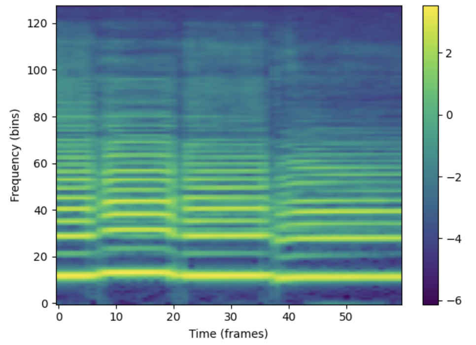  
*Figure 2: Example of Mel Spectrogram Data*

### Architectures

To rigorously compare sequential modeling capabilities, we implemented two distinct architectures: a standard Autoregressive Transformer and a Baseline LSTM.

#### 1. Autoregressive Transformer

We utilized a causal Transformer architecture with sinusoidal positional encodings. To analyze the performance-capacity trade-off, we trained three size variants with increasing depth and width:

- **Small:** 2 Layers, 4 Attention Heads, Embedding Dimension of 128.
- **Medium:** 4 Layers, 8 Attention Heads, Embedding Dimension of 256.
- **Large:** 8 Layers, 16 Attention Heads, Embedding Dimension of 512.

#### 2. LSTM Baseline

We implemented a standard LSTM network that projects the 128-dimensional input into a hidden space, processes temporal steps via Long Short-Term Memory cells, and projects back to the spectral dimension. To ensure a fair comparison with the Transformer, we scaled the LSTM's capacity across three variants:

- **Small:** 1 Layer, Hidden Dimension of 256.
- **Medium:** 2 Layers, Hidden Dimension of 512.
- **Large:** 4 Layers, Hidden Dimension of 1024.

| Model Variant | Transformer Parameters | LSTM Parameters |
|---|---:|---:|
| **Small** | 544,768 | ~600,000 |
| **Medium** | 4,111,232 | ~4,300,000 |
| **Large** | 26,598,016 | ~33,850,496 |

The hyperparameters and training details of the models are below:

- **Transformer:** Trained for 35 Epochs with a Batch Size of 64 and a Learning Rate of 1e-4 (AdamW).
- **LSTM:** Trained for 35 Epochs with a Batch Size of 64 and a Learning Rate of 1e-4 (AdamW).

### Experimental Design

We conduct three primary experiments to evaluate the generative capabilities and robustness of the models.

#### 1. Future Horizon Forecasting (Varying K)

In this experiment, we test the models' ability to sustain coherent generation over longer periods. We provide a fixed context window of the first 150 frames and ask the model to predict the next *K* frames autoregressively.

- **Context:** 150 frames
- **Prediction Horizon (*K*):** [20, 60, 100] frames

#### 2. Context Sensitivity (Varying Input)

Here, we evaluate how much historical information each architecture requires to make accurate predictions. We fix the prediction horizon to a constant 60 frames and vary the size of the input context provided to the model.

- **Context Sizes:** [50, 100, 150] frames
- **Prediction Horizon:** 60 frames (constant)

#### 3. Audio Analysis

Music and Audio are an inherintly human-evaluated data format. For fair comparison and in the interest of providing readers with insight into more than visual graphs, we decided to select and cross-compare audio files that were predicted by the Transformer and LSTM to showcase.

### Evaluation Metrics

Since the output is a continuous spectral representation, we treat the generation as a regression problem.

- **Mean Squared Error (MSE):** We calculate the pixel-wise MSE between the generated Mel Spectrogram and the ground truth spectrogram.
- **Frame Accuracy:** We calculate the percentage of frames within a 10% accuracy of the ground truth for the next K-frames with the current context given.
- **Visual Inspection:** We visually compare the generated spectrogram heatmaps against the ground truth to assess the definition of harmonics and the clarity of transients.
- **Audio Inspection:** We audibly compare the ground-truth testing data to the predicted model-generated audio, allowing for qualitative understanding of the generation.

---

## Results

The results below break down performance across our three primary experimental dimensions: forecast horizon, context sensitivity, and audio comparison with references to MSE, Number of Frames within 10% accuracy of the ground truth, and visual inspection of Mel Spectrograms.

### 1. Future Horizon Forecasting (Varying K)

In this experiment, we tested the stability of the models as they were asked to predict further into the future (K = 20, 60, 100 frames).

#### LSTM

The LSTM model demonstrated distinct behavior depending on the model size when faced with the varying horizons. While the Small and Medium models had a steep degredation at longer horizons (MSE > 4.0 at K=60), the Large model was surprisingly much more robust, achieving the lowest MSE of 3.23 at K=60 and 3.58 at K=100. The MSE vs K plot suggests that for LSTMs, increased parameter count directly translates to better long-term stability, agreeing with standard scaling laws. Furthermore, looking towards the Frame Accuracy vs K plot, we see how with shorter horizons, the Small and Medium models perform substantially better while the Large model is consistently the best for long horizon prediction.

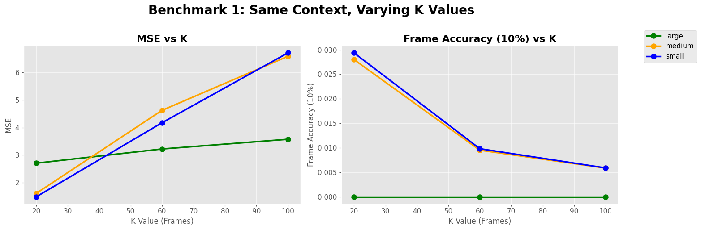  
*Figure 3: LSTM performance with Varying K-frame horizon. Note the Large model (Green) maintains the lowest error at K=60 and K=100.*

#### Autoregressive Transformer

On the other hand, the Transformer showed a different scaling trend, quite to our surprise. This surprise arises from the performance of the Medium model, which consistently outperformed the Large variant, suggesting that the Large Transformer possibly suffered from overfitting given the dataset size. While the Transformer's MSE errors were generally comparable to the LSTM, its inference capabilities with the Frame accuracy (within 10% of the ground truth) remained higher in the short term. Additionally, it is surprising to see how similar the performance of the Small Transformer and Large Transformer are, leading to interesting questions about scaling laws.

.png)  
*Figure 4: Transformer MSE and Frame Accuracy vs. K. The Medium model (Orange) demonstrates the best retention of accuracy.*

---

### 2. Context Sensitivity (Varying Input)

We analyzed how the length of the input history (50, 100, or 150 frames) impacted the ability to predict the next 60 frames through Mel Spectrogram data and MSE/Frame Accuracy plots.

#### LSTM Baseline

Firstly, the LSTM benefited from increased context, with the gains were mainly presented in the Large model. Increasing context from 50 to 150 frames reduced the Large model's MSE from 3.77 to 3.23. However, the Frame Accuracy remained relatively low (less than 18%) across all context sizes, reinforcing the notion that LSTMs struggle with precise pixel-level reconstruction even when the overall contour is correct. Additionally, we see non-linear behavior when increasing from 50 to 100 frames of context, the LSTM across all model sizes either decreases in MSE or accuracy or stays at a relatively stable at the same as the 50 frame values. The 150 frames of context almost always provided improved results, except for the small and medium models in the Frame Accuracy evaluation.

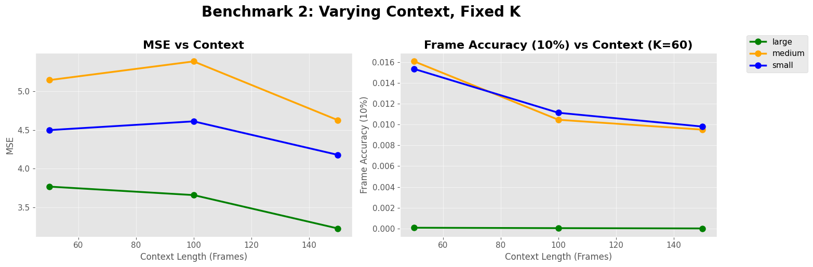  
*Figure 5: LSTM MSE vs. Context Size. The Large model (Green) shows a clear benefit from longer context, while smaller models fluctuate.*

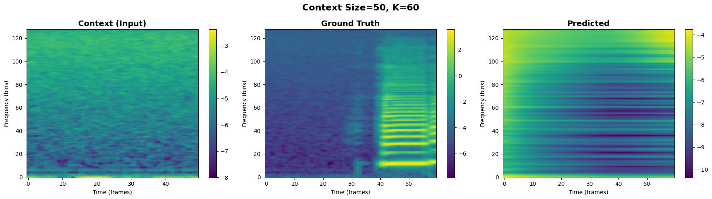  
*Figure 6: Large Model Mel Spectrogram of Context provided, Ground Truth, and Predicted output for K=50*

The prediction is extremely blurry. The model fails to capture the onset of new notes, resulting in a "smearing" effect where distinct harmonic lines merge into a single, undefined wash of energy. The high frequencies (>80 bins) are almost entirely absent.

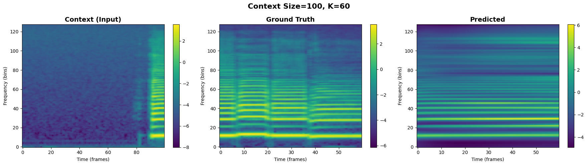  
*Figure 7: Large Model Mel Spectrogram of Context provided, Ground Truth, and Predicted output for K=100*

We begin to see the emergence of distinct harmonic bands, but they remain faint and disconnected. The model struggles to maintain the energy of the fundamental frequency.

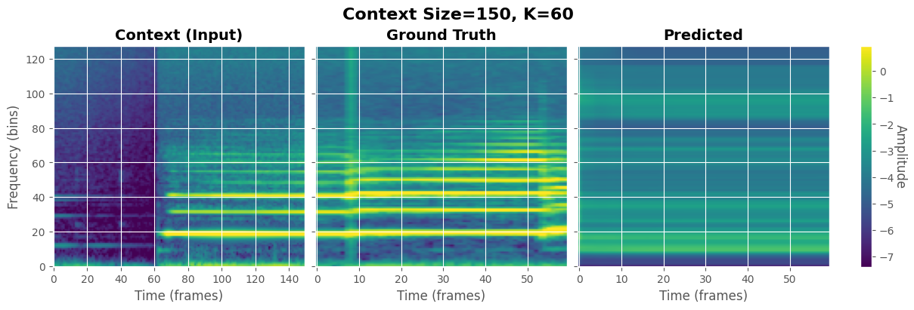  
*Figure 8: Large Model Mel Spectrogram of Context provided, Ground Truth, and Predicted output for K=150*

The horizontal harmonic lines are more continuous, and there is a noticeable improvement in the definition of the lower frequencies (0-40 bins). However, even with highest context provided, the LSTM still showcases an unexpected amount spectral smoothing compared to the Ground Truth, struggling to reproduce the sharp, vertical lines that characterize a musical note. This further showcases the complexity of audio data from "basic" time-series data.

For LSTMs, "more context" is only beneficial if the model has the parameter capacity to store it when considering relative error and frame accuracy. The Large model successfully leverages the 3.5-second history (150 frames) to reduce error, while smaller models appear overwhelmed by the sequence length although still improving relatively.

#### Autoregressive Transformer

The Transformer exhibited an interesting response to context compared to the LSTM. Increasing the context window to 150 frames caused overall loosely correlated fluctuates to both MSE and Frame Accuracy (reaching ~20% for the Medium model). In slight similarity to the LSTM, we observe the same stagnation or decrease of accuracy with the 100 frames of context, begging the question as to the non-linearity of the relationship. This may be due to the inherint structure of audio data and music composition, such that 100 frames of context creates complexity. Overall, the medium model performed the best, with the large model performing significantly worse than all the other models.

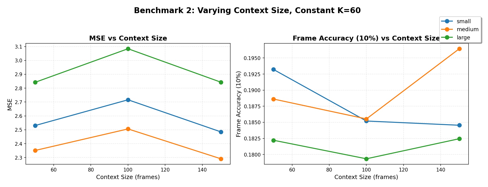  
*Figure 9: Transformer Context Sensitivity. Increasing context to 150 frames yields a clear improvement in fidelity.*

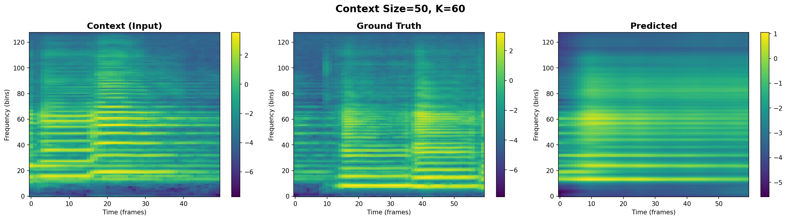  
*Figure 10: Medium Model Mel Spectrogram of Context provided, Ground Truth, and Predicted output for K=50*

The prediction suffers from "spectral smoothing." While the model captures the general energy pattern (the bottom yellow band), it still fails to produce distinct harmonic lines in the mid-frequencies. The output appears as a blurry "wash" of sound, indicating the model lacks sufficient history to infer the specific audio textures, which is expected with the lower context.

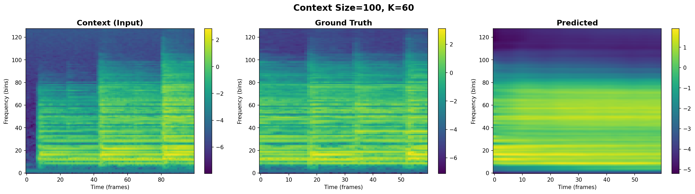  
*Figure 11: Medium Model Mel Spectrogram of Context provided, Ground Truth, and Predicted output for K=100*

Now, we are able to see the emergence of structure, but it still is not strongly represented. The horizontal harmonic bands begin to separate from the aforementioned “wash”, but the model does still struggle with the sharper features. Even though the spectrogram seems more defined, we know that the Context=100 resulted in a dip in performance,  this is likely due to the model attempting to predict more complex structures but missing slightly, resulting in higher pixel-wise penalties than the "safe" spectrogram of Context=50.

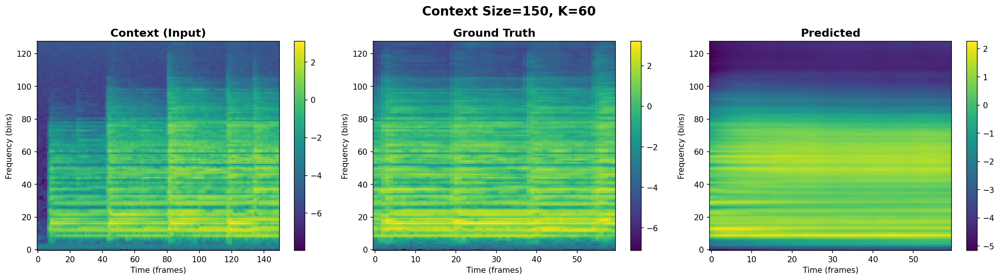  
*Figure 12: Medium Model Mel Spectrogram of Context provided, Ground Truth, and Predicted output for K=150*

Hypothetically, this should have produced the highest fidelity output, but this is contrasted by a visually similar spectrogram to the Context=100 spectrogram. Furthermore, some high-frequency detail is still smoothed out compared to the Ground Truth, the overall spectral texture is sharper and more coherent than the shorter-context models, but lacks the vertical lines of texture from the ground truth and context.

Unlike the linear scaling of the Large LSTM, the Transformer appears to require a longer context window to fully activate its potential in terms of our graphs and spectrogram analysis. With 150 frames, the self-attention mechanism seems aggregate enough historical dependencies to resolve issues with lower context, however, this improvement is not strongly represented visually nor is it a magnitude of improvement quantitiatively as showcased in Figures 9-12.

---

### 3. Audio Comparison (Compared with Ground Truth)

We seek to compare the LSTM Large Model and Transformer's Medium Model audio predictive capabilities as we display the generated sampled LSTM output through audio and a generated Transformer through audio on the same context and ground truth, allowing for qualitative analysis of the overall models while also comparing with the spectrogram equivalent.

**Transformer and LSTM Audio Demonstration**

1. Context (Input): `audio/transformercontext.m4a`  
2. Transformer Prediction: `audio/transformersgenerative.m4a`  
3. LSTM Prediction (TURN AUDIO DOWN): `audio/predicted_LSTM.m4a`  
4. Ground Truth: `audio/transformerground.m4a`

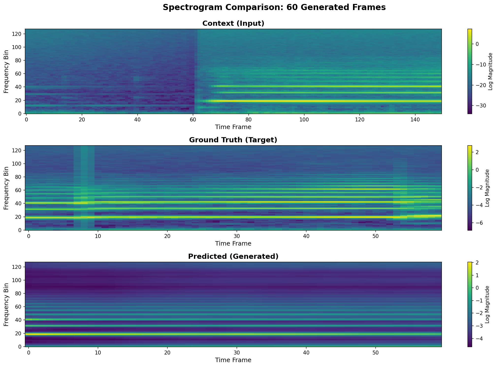  
*Figure 13: Mel Spectrogram of Transformer Medium-sized Model corresponding to generated audio above.*

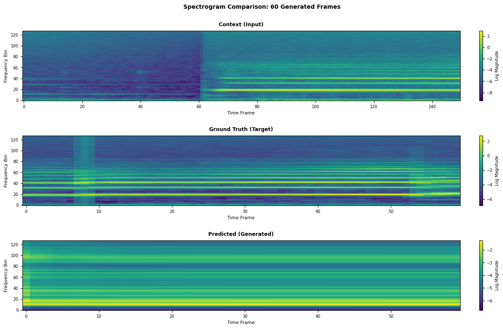  
*Figure 14: Mel Spectrogram of LSTM Large-sized Model corresponding to generated audio above.*

While the generated audio is audibly similar to an extent, we can visually inspect that many of the complex features such as vertical lines within the spectrograms fail to be shown for the Transformer model, however, the underlying horizontal line patterns appear in some capacity. In comparison, the LSTM generated audio is essentially just static, and as we inspect the spectrogram, we can see less sharper features showcased then what the ground truth would expect. However, slight vertical lines are present which were absent from the Transformers.

---

## Discussion

Our initial expectations centered around the assumption that Transformers would require a much larger dataset to reach strong performance. We believed that the global relationship bias of Transformers would not be fully activated with only twelve thousand samples. We also expected that the heavy compression produced by the Mel Spectrogram representation would reduce the long range dependencies that Transformers are designed to capture. As a result, we predicted that LSTM based models would perform better across context sizes and predictive horizons.

The empirical results did not support these expectations. Across both context sizes and future frame horizons, the Transformer produced lower error values, higher frame accuracy values, and higher quality results during qualitative evaluation. These findings indicate that the dataset was large enough for the Transformer to learn meaningful global patterns in the music. The results also suggest that model size does not strictly correlate with better performance. The LSTM followed a more traditional scaling behavior, since the large model consistently outperformed the smaller ones. In contrast, the Transformer achieved its strongest results in the medium sized model. The large model did not generalize as well, most likely due to limited data, poor optimization, or insufficiently stable training. This pattern was surprising and highlighted the sensitivity of Transformers to model capacity and dataset size.

### Benchmark 1: Future Horizon Analysis

The Transformer showed predictable degradation as the prediction horizon increased. All models produced higher error values and lower accuracy values as K increased. However, the medium model consistently remained the strongest performer. The small and large models produced very similar results. The underperformance of the large model was likely due to overfitting. A model with more than twenty million parameters requires either a much larger dataset or a more careful optimization schedule. The large learning rate we used may have prevented the model from discovering stable and generalizable patterns. A reduced learning rate would likely improve the performance of the large Transformer by reducing instability during training.

The LSTM displayed a very different behavior. The large LSTM produced the lowest error values across prediction horizons, yet its frame accuracy remained consistently low. This suggests that the model generated stable predictions that were slightly outside of the ten percent accuracy threshold. The small and medium LSTM models produced more varied predictions, since their error and accuracy values fluctuated more strongly as the horizon increased. These observations match expectations for recurrent networks, since these models often struggle with stability when predicting far into the future.

### Benchmark 2: Context Sensitivity

The Transformer displayed a loose overall trend of improved performance when more context was provided. The medium model benefitted most clearly from the larger context window, since the one hundred fifty frame condition reduced error and increased accuracy relative to the fifty frame condition. The one hundred frame condition produced unexpectedly worse results. A possible explanation is that one hundred frames is not enough to establish the structure of the musical phrase, yet it may introduce more complexity than the shorter context window. In contrast, one hundred fifty frames provide a complete view of the evolving audio, which may allow the model to form more stable representations.

The LSTM displayed a more predictable relationship between context size and performance. The large model improved consistently when provided with longer context windows. The medium and small LSTM models occasionally underperformed at one hundred frames in ways that resembled the Transformer behavior, which suggests that this mid range context window contains structural ambiguities. The broader trend confirms that longer context windows generally help LSTM models, especially when the model has enough capacity to store and process extended temporal information.

### Spectrogram Analysis

The spectrogram comparisons revealed clear differences in qualitative behavior. The LSTM predictions displayed significant smoothing across most of the frequency bins. Harmonic lines that appear sharply in the ground truth became blurred into broad regions of energy. This suggests that the LSTM converged toward averaged predictions when uncertain. The Transformer produced more distinct harmonic structures that resembled the ground truth more closely. The Transformer also preserved more of the energy distribution across the mid range frequencies. However, both models failed to produce sharp vertical structures and detailed transients. This indicates that while Transformers capture global relationships more effectively, both architectures struggle with fine grained musical detail in autoregressive generation tasks.

### Audio Comparison

The audio comparison highlighted the strengths and weaknesses of each model. The Transformer generated audio samples that were more consistent with the ground truth in terms of pitch, loudness, and timbral structure. The LSTM generated audio that was noticeably noisier and louder than the context signal. The LSTM also diverged rapidly from the reference audio. The Transformer preserved subtle characteristics such as amplitude variation, frequency contouring, and general shape of the melody. These observations support the quantitative results and show that the Transformer was better at capturing global musical relationships.

### Future Work and Conclusion

Future work can focus on improving the training strategy and architectural design of the Transformer. The larger Transformer struggled to use its full parameter capacity, which suggests that the model would benefit from a more controlled learning rate schedule and more careful optimization. Adjustments that stabilize early training and guide the model toward smoother convergence would likely improve performance and allow the larger model to generalize more effectively.

Another promising direction involves exploring audio specific architectures that combine attention with convolution. These designs can capture both local frequency detail and broader musical structure and may allow the model to learn sharper harmonics and more expressive timbral patterns. Improvements to the dataset would also be valuable. Data augmentation methods such as time stretching, pitch shifting, and frequency masking would increase diversity and reduce overfitting, and a wider range of instruments and musical passages would give the model richer material to learn from.

In conclusion, the Transformer showed stronger ability to capture long range musical relationships and produced clearer and more stable audio predictions than the LSTM. The project highlights the importance of optimization choices and specialized architecture design, especially as model size increases. Although autoregressive forecasting remains challenging due to accumulating error, these findings indicate that attention based models are a strong foundation for future work in musical audio generation and sequence prediction.

---

## References

[1] [Long Short-Term Memory](https://www.bioinf.jku.at/publications/older/2604.pdf), Hochreiter, S., & Schmidhuber, J., 1997  
[2] [Attention Is All You Need](https://arxiv.org/abs/1706.03762), Vaswani, A., et al., 2017  
[3] [A First Look at Music Composition Using LSTM Recurrent Neural Networks](https://people.idsia.ch/~juergen/blues/IDSIA-07-02.pdf), Eck, D., & Schmidhuber, J., 2002  
[4] [Comparison of LSTM and Transformer for Time Series Data Forecasting](https://ieeexplore.ieee.org/abstract/document/10472466), Hittawe, M., Sidahmed, H., & Elshiekh, S., 2024  
[5] [Scaling Autoregressive Video Models](https://arxiv.org/abs/1904.10509), Weissenborn, D., Täckström, O., & Uszkoreit, J., 2020  
[6] [Music Transformer](https://arxiv.org/abs/1809.04281), Huang, C. Z. A., et al., 2018  
[7] [MelNet: A Generative Model for Audio in the Frequency Domain](https://arxiv.org/abs/1906.01083), Vasquez, S., & Lewis, M., 2019  
[8] [SpecTNT: A Time-Frequency Transformer for Music Audio](https://arxiv.org/abs/2110.09127), Lu, W. T., et al., 2021  
[9] [Medley-solos-DB: a cross-collection dataset for musical instrument recognition](https://doi.org/10.5281/zenodo.2582103), Lostanlen, V., Cella, C.-E., Bittner, R., & Essid, S., 2019
